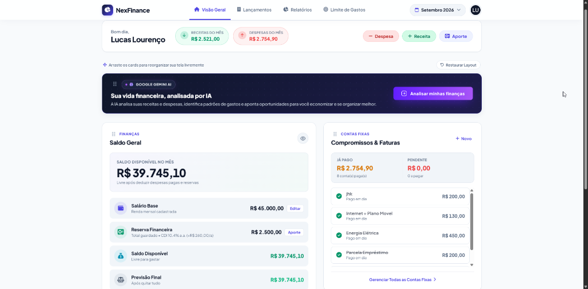
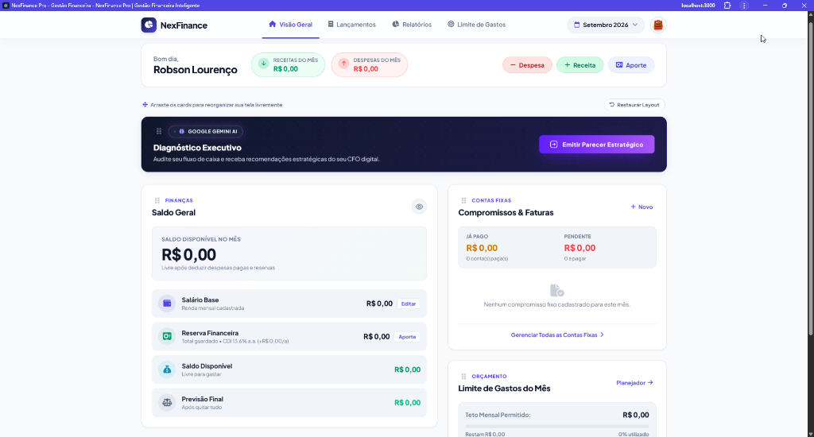
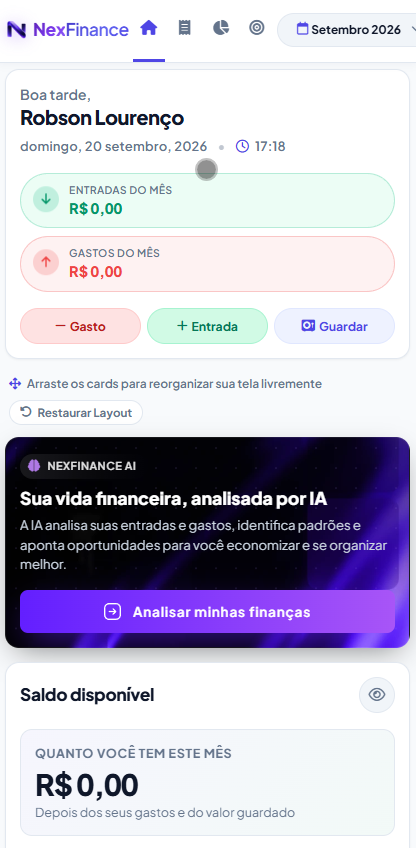
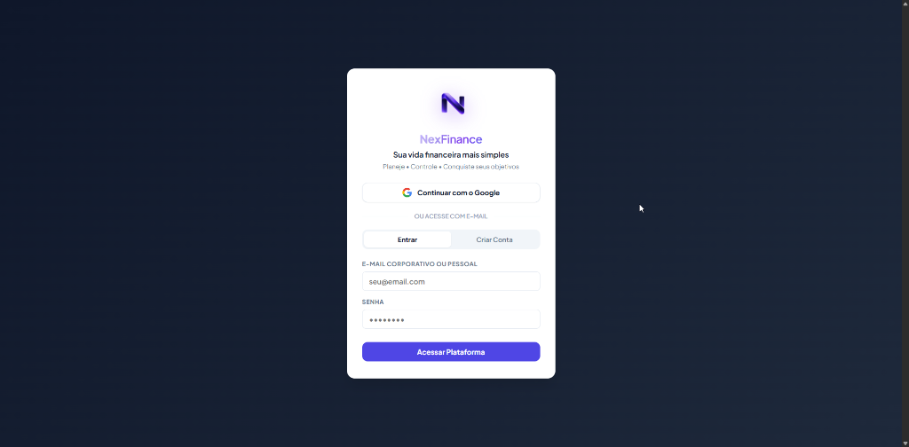
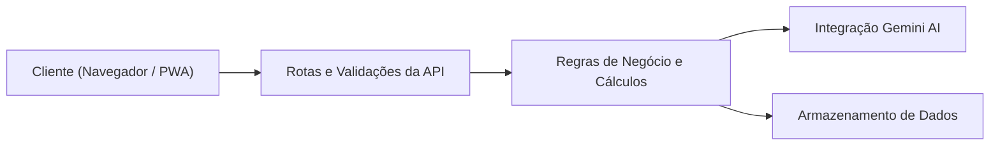

  

  # NexFinance

  **Plataforma de gestão financeira desenvolvida para simplificar o controle de contas e transformar dados em decisões mais claras.**

  

    <a href="https://nexfinance.squareweb.app/"><strong>Ver sistema</strong></a> •
    <a href="#telas-do-sistema"><strong>Telas do sistema</strong></a> •
    <a href="#funcionalidades"><strong>Funcionalidades</strong></a> •
    <a href="#tecnologias"><strong>Tecnologias</strong></a> •
    <a href="docs/architecture.md"><strong>Arquitetura</strong></a> •
    <a href="docs/security.md"><strong>Segurança</strong></a>
  

  

    
    
    
    
  

  

    Projeto desenvolvido por Robson Lourenço.
  

---

## Sobre o Projeto

O **NexFinance** foi criado para resolver uma dificuldade comum: a falta de clareza rápida sobre quanto dinheiro realmente está livre no mês após pagar as contas e guardar as reservas.

Em vez de planilhas manuais ou interfaces cheias de menus desnecessários, o sistema organiza o fluxo financeiro em um painel direto. O foco principal é mostrar o **Saldo Disponível Real**, os **Compromissos do Mês** e a **Previsão Final de Fechamento**, com suporte a projeção automática de despesas fixas para os meses seguintes.

Principais objetivos do projeto:
- Centralizar receitas, contas a pagar e despesas diárias em um só lugar.
- Calcular na hora o saldo líquido livre para uso no mês.
- Permitir navegação por períodos passados e futuros de forma contínua.
- Oferecer uma experiência rápida, leve e instalável no celular ou computador via PWA.
- Auxiliar no planejamento financeiro com diagnósticos gerados por inteligência artificial.

---

## Telas do Sistema

### Dashboard Principal
Visão geral com resumo financeiro, faturas pendentes, reserva com rendimento CDI e atalhos rápidos.

  

 

### Indicadores e Controle Financeiro
Acompanhamento detalhado de saldo disponível, salário base, faturas pagas e previsão após quitar as pendências.

  

 

### Versão Mobile (PWA)
Interface adaptada para smartphones, com navegação por toque e layout limpo.

  

 

### Acesso e Autenticação
Tela de login com suporte a e-mail e autenticação Google.

  

---

## Funcionalidades

### Painel Financeiro
- Calculo dinâmico de saldo disponível (descontando despesas pagas e reservas).
- Previsão final do mês considerando todas as contas ainda pendentes.
- Acompanhamento de reserva financeira com indicador da taxa CDI.

### Gestão de Períodos e Contas
- Seletor de mês que permite visualizar dados de qualquer período anterior ou futuro.
- Projeção de despesas fixas recorrentes (luz, água, aluguel, internet) para meses seguintes como pendentes.
- Alternância de status de contas (paga / a pagar) com um clique e atualização imediata nos cálculos.
- Edição de nome, valor, data de vencimento e notas de qualquer lançamento registrado.

### Assistente com Inteligência Artificial
- Integração com a API do Google Gemini para analisar os lançamentos do mês.
- Identificação de padrões de gastos e recomendações práticas para economia.

### Personalização e Recursos Úteis
- Suporte a múltiplos temas visuais (Original, Rosa, Verde, Laranja e Dark).
- Modo privacidade para ocultar valores na tela com um clique.
- Organização de cards na tela inicial via arrastar e soltar (drag and drop).

---

## Tecnologias

| Área | Tecnologias Utilizadas |
|---|---|
| Frontend | HTML5 semântico, CSS3 moderno, JavaScript puro (ES6+) |
| Gráficos | Chart.js |
| Mobile & Offline | Service Worker, Cache API, Web App Manifest (PWA) |
| Backend | Node.js |
| Inteligência Artificial | Google Gemini API |
| Autenticação | Bcrypt, tokens de sessão, Google Identity Services (OAuth 2.0) |
| Hospedagem | Square Cloud |

---

## Arquitetura

O sistema foi estruturado em camadas desacopladas para manter o frontend rápido e o backend enxuto:

Uma explicação conceitual dos componentes e do funcionamento offline está disponível em:  
[Documentação de Arquitetura (docs/architecture.md)](docs/architecture.md)

---

## Segurança

O projeto segue boas práticas de desenvolvimento para proteger as informações dos usuários:

- Senhas de acesso são armazenadas exclusivamente utilizando hash criptográfico com `bcrypt`.
- Sessões de usuário autenticadas por tokens de acesso individuais.
- Isolamento de dados por usuário, garantindo que cada conta acesse apenas seus próprios registros.
- Chaves de API e variáveis de ambiente mantidas fora do controle de versão via `.env`.
- Scripts de publicação configurados para preservar o banco de dados dos usuários em produção.

Mais informações sobre a abordagem de segurança estão descritas em:  
[Diretrizes de Segurança (docs/security.md)](docs/security.md)

---

## Responsividade

O NexFinance foi desenvolvido com foco em responsividade para funcionar bem em celulares, tablets e desktops:
- Em smartphones, os botões e formulários são ajustados para uso com uma mão e toque rápido.
- Em computadores, o layout aproveita o espaço horizontal com distribuição modular dos cartões.
- Como PWA, pode ser adicionado à tela inicial de aparelhos Android e iOS sem depender de lojas de aplicativos.

---

## Sobre este Repositório

Este repositório funciona como uma apresentação pública do NexFinance. Aqui estão reunidas as principais informações sobre o projeto, sua arquitetura conceitual, recursos desenvolvidos e telas do sistema.

O código-fonte completo, módulos internos de backend e o banco de dados permanecem em repositório privado.

---

  NexFinance Pro — desenvolvido por Robson Lourenço.

