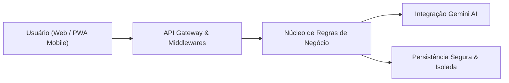

  

  # NexFinance

  **Gestão financeira inteligente para transformar dados em decisões.**

  

    Uma plataforma completa de controle patrimonial, inteligência analítica e planejamento orçamentário desenvolvida com foco em alta performance, privacidade rigorosa e experiência de usuário de nível executivo.
  

  

    <a href="#demonstracao-visual"><strong>Ver Demonstração</strong></a> •
    <a href="docs/architecture.md"><strong>Arquitetura</strong></a> •
    <a href="docs/security.md"><strong>Segurança</strong></a> •
    <a href="#funcionalidades"><strong>Funcionalidades</strong></a> •
    <a href="#tecnologias"><strong>Tecnologias</strong></a>
  

  

    
    
    
    
  

---

## Sobre o Projeto

O **NexFinance** nasceu para resolver um problema recorrente na gestão financeira pessoal e empresarial: a fragmentação de informações e a falta de clareza estratégica no fluxo de caixa.

Em vez de planilhas complexas ou aplicativos cheios de distrações, o NexFinance centraliza todo o ciclo financeiro do usuário em um painel executivo direto, fornecendo visão instantânea de **Saldo Real Disponível**, **Compromissos Fixos Recorrentes**, **Previsão Final de Fechamento** e **Auditoria Inteligente por IA**.

### Proposta de Valor
- **Visibilidade Imediata:** Saiba exatamente quanto dinheiro está livre para gastos após deduzir contas a pagar e reservas.
- **Continuidade Temporal:** Planejamento contínuo com seletor de competência mensal (`YYYY-MM`) e projeção automática de custos recorrentes para os meses seguintes.
- **Consultoria com IA Integrada:** Auditor de gastos com IA (Google Gemini) que identifica gargalos financeiros e oferece pareceres acionáveis.
- **Portabilidade Total (PWA):** Instale em qualquer smartphone (Android/iOS) ou computador sem necessidade de download em lojas de apps, com suporte a cache inteligente offline.

---

## Demonstração Visual

### Dashboard Executivo
Painel consolidado com resumo patrimonial, alertas de contas a pagar, métricas de CDI e assistente executivo.

  

 

### Visão Geral e Indicadores em Tempo Real
Acompanhamento de saldo real, reserva financeira, projeção de fechamento e faturas pendentes.

  

 

### Experiência Mobile & PWA
Interface totalmente responsiva adaptada para qualquer resolução de tela móvel com navegação rápida por toque.

  

 

### Autenticação e Segurança
Tela de acesso limpa e moderna com autenticação por credenciais criptografadas e integração com Google Identity (OAuth 2.0).

  

---

## Funcionalidades

### Painel Financeiro Executivo
- **Saldo Disponível Real:** Cálculo dinâmico que desconta reservas e compromissos pagos.
- **Previsão Final:** Projeção líquida de encerramento do mês considerando todas as pendências em aberto.
- **Reserva com Rendimento CDI:** Acompanhamento patrimonial com atualização da taxa CDI.

### Gestão de Competências e Pendências
- **Navegador Temporal de Meses:** Alterne com facilidade entre meses anteriores e futuros.
- **Contas Fixas e Recorrentes:** Projeção automática de contas (aluguel, água, energia, assinaturas) para novos períodos com status "A pagar".
- **Alternância Instantânea de Status:** Marque contas como pagas ou a pagar em 1 clique, com reflexo imediato nos saldos.
- **Edição Completa de Lançamentos:** Altere valores, descrições, notas e datas de qualquer pendência registrada.

### Assistente Financeiro (Google Gemini AI)
- Diagnóstico automatizado das receitas versus despesas do mês.
- Detecção de desvios no orçamento e sugestões personalizadas para economia e investimento.

### Personalização e Acessibilidade
- **Multi-temas:** 5 temas nativos (Original Blue, Rosa, Verde Esmeralda, Laranja e Dark/Black).
- **Modo Privacidade:** Oculte valores com um clique para visualizar o painel em ambientes públicos.
- **Drag-and-Drop:** Reorganize os cards da tela inicial conforme a prioridade do seu dia a dia.

---

## Stack Tecnológica

| Camada | Tecnologia | Finalidade |
|---|---|---|
| **Frontend Core** | HTML5 Semântico, CSS3 Moderno, JavaScript (ES6+) | Interface ultrarrápida, sem dependência de frameworks pesados |
| **Visualização de Dados** | Chart.js | Gráficos interativos de rosca e barras de fluxo |
| **Experiência Mobile** | Service Worker, Web App Manifest, Cache API | Funcionamento como Progressive Web App (PWA) instalável |
| **Backend & API** | Node.js | Servidor de microsserviços REST leve, assíncrono e performático |
| **Inteligência Artificial**| Google Gemini API | Motor de análise e consultoria financeira estratégica |
| **Autenticação** | Bcrypt, JWT / Sessões Seguras, Google Identity (OAuth 2.0) | Controle de acesso estrito e proteção de identidade |
| **Deploy & Hosting** | Square Cloud | Infraestrutura de hospedagem segura com isolamento de contêineres |

---

## Arquitetura de Alto Nível

Para uma análise detalhada dos fluxos de dados, componentes e estratégias de redundância offline:  
**Consulte:** [Documentação de Arquitetura (docs/architecture.md)](docs/architecture.md)

---

## Segurança e Privacidade

- **Criptografia de Senhas:** Hashes unidirecionais seguros (`bcrypt`) impedem a exposição de credenciais.
- **Segregação Rigorosa:** Cada usuário possui seu ambiente e dados 100% isolados.
- **Ambiente Isolado (.env):** Chaves de serviços externos e credenciais permanecem protegidas em variáveis de ambiente, nunca commitadas no controle de versão.
- **Proteção do Banco no Deploy:** Mecanismo automático que impede que atualizações de código sobrescrevam o banco de dados dos usuários em produção.

Para detalhes sobre os padrões e práticas de segurança implementados:  
**Consulte:** [Diretrizes de Segurança (docs/security.md)](docs/security.md)

---

## Responsividade Multiplataforma

O NexFinance foi projetado com abordagem *mobile-first*:
- **Smartphones:** Interface compacta com botões de ação rápida, menus deslizantes e modais ergonômicos.
- **Tablets:** Grid inteligente com distribuição balanceada de cartões e gráficos.
- **Desktops:** Dashboard panorâmico modular com suporte a múltiplos monitores.

---

## Sobre este Repositório (Showcase)

> **Nota Institucional:**  
> Este repositório é uma apresentação pública de portfólio técnico (*Showcase*), criada para demonstrar o design de produto, a arquitetura de software e os padrões de engenharia adotados no desenvolvimento do **NexFinance**.
>
> Por razões de propriedade intelectual e segurança comercial, o código-fonte proprietário completo, os módulos internos de backend e o banco de dados não fazem parte deste repositório público e são mantidos de forma privada.

---

  Desenvolvido por Robson Lourenço • NexFinance Pro • Todos os direitos reservados.

