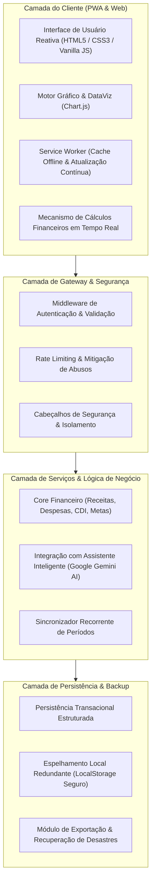

# Visão Geral de Arquitetura — NexFinance

Este documento apresenta uma visão conceitual de alto nível sobre os padrões de engenharia de software e a infraestrutura tecnológica do **NexFinance**.

---

## Visão Conceitual

O NexFinance foi projetado seguindo uma arquitetura multicamadas moderna, desacoplada e voltada para a máxima performance do usuário final, combinando a rapidez de uma Progressive Web App (PWA) client-side com um backend leve e resiliente em Node.js.

---

## Principais Componentes do Sistema

### 1. Camada de Apresentação (Frontend & PWA)
- **Zero Framework Overhead:** Construído com JavaScript moderno (ES6+), garantindo carregamento instantâneo sem a sobrecarga de bundles pesados.
- **Service Worker Lifecycle:** Implementa estratégias de cache para navegação veloz e redundância offline, permitindo uso fluido mesmo em conexões instáveis.
- **Visualização de Dados:** Integração com Chart.js para renderização de balanços, distribuição por categorias e projeção patrimonial em gráficos interativos.
- **Design System Adaptativo:** Estrutura modular com CSS Custom Properties suportando temas múltiplos (Original, Rosa, Verde, Laranja, Dark/Black) e responsividade fluida para Mobile, Tablet e Desktop.

### 2. Camada de Serviços e API
- **Arquitetura RESTful:** Endpoints padronizados com payloads JSON estritos para autenticação, consultas por período e transações.
- **Controle de Período Mensal:** Algoritmo de normalização temporal que consolida previsões, contas fixas, pendências e receitas por competência (`YYYY-MM`).
- **Assistente Financeiro Inteligente:** Conexão segura orientada a prompts estruturados com a API do Google Gemini, oferecendo auditoria de gastos e diagnósticos executivos personalizados.

### 3. Camada de Persistência e Integridade
- **Armazenamento Transacional:** Isolamento completo de dados por usuário logado.
- **Auditoria & Sanitização:** Mecanismo de autocorreção e validação de consistência monetária e temporal antes de qualquer escrita em disco.
- **Exportação e Portabilidade:** Suporte a backups integrais dos registros financeiros em formato JSON auditável.

---

> **Aviso de Propriedade:** Este documento visa exclusivamente fornecer uma contextualização conceitual de engenharia. Os módulos proprietários, implementações algorítmicas internas e configurações de produção são mantidos em repositório privado.
