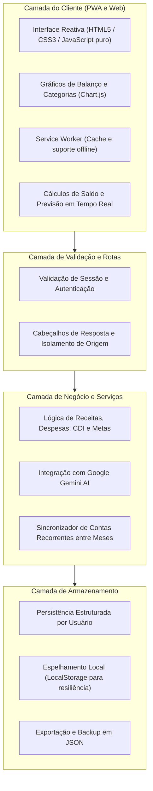

# Visão de Arquitetura — NexFinance

Este documento apresenta uma visão conceitual sobre a estrutura e os componentes técnicos do **NexFinance**.

---

## Organização em Camadas

O sistema foi estruturado em camadas desacopladas para manter o frontend ágil e o backend simples e eficiente:

---

## Componentes do Sistema

### 1. Interface e Frontend (PWA)
- **JavaScript nativo (ES6+):** Código direto sem necessidade de compiladores ou frameworks pesados, garantindo carregamento rápido.
- **Service Worker:** Estratégias de cache para manter o app responsivo e utilizável mesmo com oscilações de rede.
- **Gráficos interativos:** Uso da biblioteca Chart.js para visualização clara de distribuição por categorias e evolução do saldo.
- **Estilos adaptativos:** CSS estruturado com variáveis customizadas para suporte a temas variados e adaptação a diferentes tamanhos de tela.

### 2. Backend e Serviços
- **Rotas estruturadas:** Endpoints em Node.js com comunicação via JSON para autenticação, consultas e lançamentos.
- **Controle por competência mensal:** Rotina que organiza dados por mês (`YYYY-MM`) e replica despesas fixas recorrentes para períodos futuros.
- **Assistente inteligente:** Chamadas estruturadas à API do Google Gemini para emitir diagnósticos das finanças cadastradas.

### 3. Armazenamento e Integridade
- **Isolamento por conta:** Cada usuário autenticado acessa unicamente suas próprias transações.
- **Validação de entradas:** Checagem de datas, categorias e valores numéricos antes da gravação.
- **Portabilidade:** Funcionalidade que permite exportar todo o histórico financeiro em arquivo JSON.

---

> Este documento tem caráter informativo para apresentar a arquitetura do projeto. O código-fonte completo e os módulos de backend permanecem em repositório privado.
